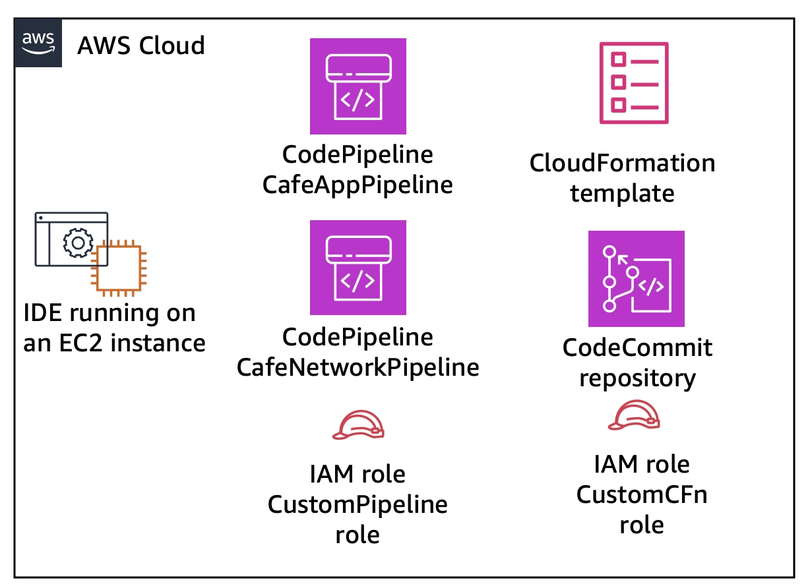

<div align="center">

# PROJECT: CAFÉ CLOUD
### *The Evolving Café Architecture*

  

</div>

---

<div align="center">

### 🛠️ Technologies Used


<br>


</div>


---

## 🔭 PROJECT SYNOPSIS
**Café Cloud** is a comprehensive cloud engineering project demonstrating the end-to-end migration and evolution of a business application on AWS.

Starting from a humble **static website (V1)**, this project documents the iterative transformation of the café's infrastructure into a **dynamic, highly available, and fault-tolerant system**. The journey covers the migration to **EC2 compute (V2)**, database decoupling with **RDS (V3)**, network hardening via **VPC (V4)**, scaling with **ELB & ASG (V5)**, multi-region automation via **CloudFormation (V6)**, and finally, optimizing with **Serverless Lambda (V7)**.

This repository serves as a master log of every architectural decision, configuration, and deployment step taken to modernize the business.

## 📑 TABLE OF CONTENTS
*   [Scenario & Background](#-scenario--background)
*   [Technical Strategy](#-technical-strategy)
*   [Architecture Roadmap](#-architecture-roadmap)
*   [V1: Static Website (S3)](#-v1-creating-a-static-website-for-the-café)
*   [V2: Dynamic Website (EC2)](#-v2-add-the-support-dynamic-content-and-online-ordering)
*   [V3: Database Migration (RDS)](#-v3-migrating-a-database-to-amazon-rds)
*   [V4: Network Hardening (VPC)](#-v4-creating-a-vpc-networking-environment-for-the-café)
*   [V5: Scaling & HA (ELB/ASG)](#-v5-creating-a-scalable-and-highly-available-environment-for-the-café)
*   [V6: Automation (CloudFormation)](#-v6-automating-infrastructure-deployment)
*   [V7: Serverless (Lambda)](#-v7-implementing-a-serverless-architecture-for-the-café)
*   [Key Learnings](#-key-learnings--challenges)
*   [Future Roadmap](#-future-roadmap)

---

## 📖 SCENARIO & BACKGROUND

### ☕ The Business Case
**Frank and Martha** are a husband-and-wife team who own and operate a small, beloved café in a large city, famous for its high-quality desserts and coffee. They are assisted by their daughter, **Sofía**, and their employee, **Himanshu** (a post grad student at George Brown College, Me basically).

Despite their reputation among locals, the café lacks a marketing strategy and relies entirely on foot traffic and word-of-mouth. They have **zero web presence** and currently use **no cloud computing services**.

### 💡 The Transformation
Sofía has proposed expanding community awareness to showcase what the café has to offer. The goal is to launch a website that provides:
*   Visual showcases of their desserts and coffee.
*   Business details (location, hours, telephone number).

I have been tasked with leading this digital transformation.

---

## 🧠 TECHNICAL STRATEGY
This project follows the **AWS Well-Architected Framework**, focusing on five key pillars throughout the evolution:

1.  **Operational Excellence**: Automating deployments (V6, V7).
2.  **Security**: Isolating resources in Private Subnets (V3, V4).
3.  **Reliability**: Implementing Multi-AZ and Cross-Region Replication (V5, V6).
4.  **Performance Efficiency**: Using Auto Scaling and Load Balancing (V5).
5.  **Cost Optimization**: Leveraging Serverless architectures (V7).

---

## 🗺️ ARCHITECTURE ROADMAP


<details>
<summary><strong>✅ V1: Creating a Static Website for the Café</strong></summary>

<br>

> **Business Goal**: Launch a website to visually showcase offerings and provide location/hours.
> **Technical Goal**: Host a static website on Amazon S3.
> **Status**: **COMPLETED**

#### ⚙️ TECHNICAL IMPLEMENTATION


I have successfully completed the following tasks to launch the initial version:

**1. File Extraction & Preparation**
*   Downloaded the lab resources zip file.
*   Extracted `index.html`, `css/`, and `images/` folders.
*   Verified the local structure of the website assets.

**2. S3 Bucket Configuration**
*   **Service**: Amazon S3
*   **Region**: `us-east-1` (N. Virginia)
*   **Bucket Settings**:
    *   **Public Access**: *Unblocked* (Disabled "Block all public access").
    *   **ACLs**: Enabled to allow public read access via Access Control Lists.
    *   **Static Website Hosting**: Enabled.
    *   **Index Document**: Set to `index.html`.

**3. Content Deployment**
*   Uploaded the `index.html` file to the root of the bucket.
*   Uploaded the `css` and `images` folders, maintaining the directory structure.
*   Verified the upload was successful.

**4. Access Control (Bucket Policy)**
*   Implemented a **Bucket Policy** to automatically grant read-only permissions to public anonymous users.
*   **Policy Details**:
    *   *Effect*: `Allow`
    *   *Principal*: `*` (Everyone)
    *   *Action*: `s3:GetObject`
    *   *Resource*: `arn:aws:s3:::<bucket-name>/*`

#### 📸 VISUAL EVIDENCE
> **1. Website Live Preview**
> 
> *The café website running live on the S3 endpoint.*

> **2. S3 Bucket Configuration**
> 
> *Showing Static Website Hosting enabled.*

> **3. Bucket Policy**
> 
> *JSON policy granting public read access.*

> **4. Replication Policy**
> 
> *Cross-Region Replication configuration.*

> **5. Lifecycle Rule**
> 
> *Lifecycle rule to transition objects to Standard-IA.*

</details>

<details>
<summary><strong>✅ V2: Add the Support dynamic content and online ordering</strong></summary>

<br>

> **Business Goal**: Allow customers to place orders online and provide staff the ability to view submitted orders.
> **Technical Goal**: Deploy a LAMP stack application on Amazon EC2, integrate with AWS Secrets Manager, and implement a Multi-Region Disaster Recovery strategy using AMIs.
> **Status**: **COMPLETED**

#### ⚙️ TECHNICAL IMPLEMENTATION


I have successfully completed the following tasks to launch the dynamic version of the website:

**1. Environment Configuration (LAMP Stack)**
*   **OS**: Amazon Linux (Red Hat derivative).
*   **Web Server**: Apache HTTP Server (configured on port 8000).
*   **Database**: MariaDB 10.5 (installed and enabled).
*   **IDE**: Connected to VS Code Server running on the EC2 instance.
*   **Permissions**: Configured file ownership (`chown`) and symlinks to allow editing web files directly from the IDE.

**2. Application Deployment**
*   Downloaded and extracted the café application source code and database scripts.
*   Installed the **AWS SDK for PHP** to allow the application to interact with AWS services.
*   **Secrets Management**:
    *   Used `set-app-parameters.sh` to store sensitive configuration (DB credentials) in **AWS Secrets Manager**.
    *   Configured the application to retrieve these secrets at runtime.
*   **Database Setup**:
    *   Ran `create-db.sh` to initialize the `cafe_db` schema and tables.
    *   Verified database connectivity using the MySQL CLI.

**3. Security & IAM**
*   Analyzed the **IAM Role** (`CafeRole`) attached to the EC2 instance.
*   Verified the role grants permission to read from Secrets Manager, resolving initial application permission errors.
*   Configured **Security Groups** to allow inbound traffic on TCP port 8000 (Web) and 22 (SSH).

**4. Multi-Region Expansion (Disaster Recovery)**
*   **AMI Creation**: Created a custom Amazon Machine Image (`CafeServer`) from the fully configured development instance in `us-east-1`.
*   **Production Deployment**:
    *   Launched a new instance (`ProdCafeServer`) in the **Oregon Region (us-west-2)** using the custom AMI.
    *   Configured the new instance with the `CafeRole` and appropriate Security Groups.
*   **Region-Specific Configuration**:
    *   Updated the application parameters in `us-west-2` to reflect the new region's public DNS.
    *   Verified that the production site operates independently of the development site.


#### 📸 VISUAL EVIDENCE
> **1. Online Menu & Ordering**
> 
> *The dynamic menu allowing customers to place orders.*

> **2. Order Confirmation**
> 
> *Confirmation message after placing an order.*

> **3. Multi-Region Instances**
> 
> *Showing instances running in both N. Virginia and Oregon.*

> **4. Database Configuration**
> 
> *Database connection details configured in the application.*

</details>

<details>
<summary><strong>✅ V3: Migrating a Database to Amazon RDS</strong></summary>

<br>

> **Business Goal**: Secure customer data and reduce manual server maintenance.
> **Technical Goal**: Separate the web and database layers. Migrate the database to Amazon RDS in a private subnet.
> **Status**: **COMPLETED**

#### ⚙️ TECHNICAL IMPLEMENTATION


I have successfully completed the following tasks to migrate the database:

**1. RDS Instance Creation**
*   **Service**: Amazon RDS (MariaDB)
*   **Instance**: `db.t3.micro` (Dev/Test template)
*   **Configuration**:
    *   Created in `Lab VPC` with `lab-db-subnet-group`.
    *   Configured Security Group `dbSG` to allow traffic on port 3306.
    *   Set up Master credentials and initial database parameters.

**2. Data Analysis & Export**
*   Connected to the `CafeServer` EC2 instance via **AWS Systems Manager Session Manager**.
*   Analyzed the existing local MariaDB database (`cafe_db`) and verified order history.
*   Exported the existing data using `mysqldump` to `CafeDbDump.sql`.

**3. Data Migration**
*   Established connectivity from the EC2 instance to the new RDS instance.
*   Imported the `CafeDbDump.sql` data into the RDS instance.
*   Verified data integrity by querying tables (`order`, `order_item`) on the new RDS database.

**4. Application Reconfiguration**
*   Updated **AWS Secrets Manager** (`/cafe/dbPassword`, etc.) with the new RDS endpoint and credentials.
*   The PHP application automatically picked up the new connection details.
*   Stopped the local MariaDB service on EC2 to ensure the app is using the RDS instance.
*   Verified the application functionality by placing new orders and viewing order history.

#### 📸 VISUAL EVIDENCE
> **1. RDS Instance Details**
> 
> *The newly created MariaDB instance in Amazon RDS.*

> **2. EC2 Database Status**
> 
> *Checking the status of the local database before migration.*

> **3. Existing Data Verification**
> 
> *Verifying tables in the local database.*

> **4. Imported Data Verification**
> 
> *Confirming data count in the new RDS instance after import.*

> **5. Secrets Manager Update**
> 
> *Updating database connection secrets for the application.*

</details>

<details>
<summary><strong>✅ V4: Creating a VPC Networking Environment for the Café</strong></summary>

<br>

> **Business Goal**: Ensure the application is protected against network threats by isolating resources.
> **Technical Goal**: Create a VPC with public and private subnets, a bastion host for secure access, and a NAT gateway for internet connectivity.
> **Status**: **COMPLETED**

#### ⚙️ TECHNICAL IMPLEMENTATION


I have successfully completed the following tasks to secure the network environment:

**1. Public Subnet & Internet Gateway**
*   **VPC**: Used the existing `Lab VPC`.
*   **Public Subnet**: Created `Public Subnet` (10.0.0.0/24) in `us-east-1a`.
*   **Internet Gateway**: Created and attached an IGW to the VPC.
*   **Routing**: Updated the public route table to route `0.0.0.0/0` to the Internet Gateway.

**2. Bastion Host Setup**
*   **Instance**: Launched `Bastion Host` (t2.micro, Amazon Linux 2023) in the `Public Subnet`.
*   **Security**: Created `Bastion Host SG` allowing SSH (Port 22) only from `My IP`.
*   **Key Pair**: Used `vockey` for access.

**3. Private Subnet & NAT Gateway**
*   **Private Subnet**: Created `Private Subnet` (10.0.1.0/24) in `us-east-1a`.
*   **NAT Gateway**: Deployed `Lab NAT Gateway` in the `Public Subnet` with an Elastic IP.
*   **Routing**: Created `Private Route Table` routing `0.0.0.0/0` to the NAT Gateway and associated it with the `Private Subnet`.

**4. Private Instance & Security**
*   **Instance**: Launched `Private Instance` (t2.micro, Amazon Linux 2023) in the `Private Subnet`.
*   **Key Pair**: Created a new key pair `vockey2` for this instance.
*   **Security**: Created `Private Instance SG` allowing SSH (Port 22) only from the `Bastion Host SG`.

**5. SSH Passthrough & Connectivity**
*   **Agent Forwarding**: Configured SSH agent forwarding (Pageant/ssh-agent) to pass the `vockey2` key through the Bastion Host.
*   **Verification**: Successfully connected from local machine -> Bastion Host -> Private Instance.
*   **Internet Test**: Verified the Private Instance can access the internet (ping 8.8.8.8) via the NAT Gateway.

**6. Network ACLs**
*   **Custom NACL**: Created `Lab Network ACL` and associated it with the subnets.
*   **Testing**: Launched a `Test Instance` in the Public Subnet allowing ICMP.
*   **Traffic Control**: Configured the NACL to DENY ICMP traffic from the Private Subnet to the Test Instance, verifying that the ping command stops responding.

#### 📸 VISUAL EVIDENCE
> **1. Bastion Host Creation**
> 
> *Bastion Host running in the Public Subnet.*

> **2. Bastion Access**
> 
> *Successful SSH connection to the Bastion Host.*

> **3. NAT Gateway**
> 
> *NAT Gateway created to allow internet access for private resources.*

> **4. Route Table**
> 
> *Private Route Table directing traffic to the NAT Gateway.*

> **5. Private Instance**
> 
> *Private Instance running securely in the Private Subnet.*

> **6. Private Access**
> 
> *Accessing the Private Instance via the Bastion Host using SSH Agent Forwarding.*

</details>

<details>
<summary><strong>✅ V5: Creating a Scalable and Highly Available Environment for the Café</strong></summary>

<br>

> **Business Goal**: Ensure the website stays online during traffic spikes and server failures.
> **Technical Goal**: Add a load balancer, enable auto scaling on EC2 instances, and distribute compute and database resources across two Availability Zones.
> **Status**: **COMPLETED**

#### 📖 SCENARIO
The café will soon be featured on a famous TV food show. When the show airs, Sofía and Himanshu anticipate that the café’s web server will experience a temporary spike in the number of users—perhaps even up to tens of thousands of users. Currently, the café’s web server is deployed in one Availability Zone, and Sofía and Himanshu are worried that the website won’t be able to handle the expected increase in traffic. They want to ensure that their customers have a great experience when they visit the website and that they don’t experience any issues, such as lags or delays in placing orders.

To ensure this experience, the website must be responsive, able to scale both up and down to meet fluctuating customer demand, and be highly available. Instead of overloading a single server, the architecture must distribute customer order requests across multiple application servers so it can handle the increase in demand.

#### ⚙️ TECHNICAL IMPLEMENTATION


I have successfully completed the following tasks to implement high availability and scalability:

**1. Inspecting the Environment**
*   Evaluated the current lab environment, including the VPC and network setup.
*   Verified security group ports and internet connectivity for existing instances.

**2. Network Updates (Multi-AZ)**
*   **NAT Gateway**: Created a NAT Gateway in the Public Subnet of the second Availability Zone to allow private instances to access the internet.
*   **Routing**: Configured route tables to send internet-bound traffic from instances in Private Subnet 2 to the new NAT Gateway.

**3. Launch Template Creation**
*   **Source AMI**: Used the `Cafe WebServer Image` created from the previous configuration.
*   **Instance Type**: `t2.micro`.
*   **Key Pair**: Created and associated a new key pair.
*   **Security Group**: Attached `CafeSG`.
*   **IAM Role**: Attached `CafeRole` to grant necessary permissions.
*   **Tags**: Added `Name: webserver` tag for identification.

**4. Auto Scaling Group (ASG)**
*   **Launch Template**: Used the template created above.
*   **VPC & Subnets**: Configured to use Private Subnet 1 and Private Subnet 2 for high availability.
*   **Capacity**:
    *   Desired: 2
    *   Min: 2
    *   Max: 6
*   **Scaling Policy**: Implemented Target Tracking scaling policy based on **Average CPU Utilization** (Target: 25%) with a 60-second warmup.

**5. Load Balancer (ALB)**
*   **Type**: HTTP Application Load Balancer.
*   **Subnets**: Deployed in the two Public Subnets.
*   **Security Group**: Created a new SG allowing HTTP traffic from anywhere (`0.0.0.0/0`).
*   **Target Group**: Created a new target group and associated it with the Auto Scaling Group.
*   **Health Checks**: Configured to ensure traffic is only sent to healthy instances.

**6. Testing & Verification**
*   **Load Balancing**: Accessed the application via the Load Balancer's DNS name (`/cafe`) and verified it loads correctly.
*   **Auto Scaling**:
    *   Connected to a web server instance via AWS Systems Manager Session Manager.
    *   Installed and ran `stress` tool to spike CPU usage (`stress --cpu 1 --timeout 600`).
    *   Observed the Auto Scaling Group triggering a scale-out event, launching new instances to handle the load.

#### 📸 VISUAL EVIDENCE
> **1. NAT Gateway Creation**
> 
> *NAT Gateway created for the second Availability Zone.*

> **2. Route Table Configuration**
> 
> *Routing internet traffic from Private Subnet 2 to the NAT Gateway.*

> **3. Auto Scaling Group**
> 
> *New Auto Scaling Group configured with the webserver Launch Template.*

> **4. Load Balancer Security Group**
> 
> *Security Group allowing public HTTP access to the Load Balancer.*

> **5. Target Group**
> 
> *Target Group for routing traffic to ASG instances.*

> **6. Application Load Balancer**
> 
> *The active Application Load Balancer.*

> **7. Stress Testing**
> 
> *Generating CPU load on a web server instance.*

> **8. Scale-Out Event**
> 
> *Auto Scaling Group launching a new instance in response to high CPU.*

</details>

<details>
<summary><strong>✅ V6: Automating Infrastructure Deployment</strong></summary>

<br>

> **Business Goal**: Quickly launch the café website in new regions as the business expands globally.
> **Technical Goal**: Build a version controlled CloudFormation template to deploy network and application layers. Deploy the CloudFormation stack to another Region.
> **Status**: **COMPLETED**

#### 📖 SCENARIO
Up to this point, the café staff members have created their Amazon Web Services (AWS) resources and manually configured their applications mostly by using the AWS Management Console. This approach worked well as a way for the café to get started with a web presence quickly. However, the staff members are finding it challenging to replicate their deployments to new AWS Regions so that they can support new café locations in multiple countries. They would also like to have separate development and production environments that reliably have matching configurations.

In this challenge lab, I took on the role of Sofía to automate the café's deployments and replicate them to another AWS Region using Infrastructure as Code (IaC).

#### ⚙️ TECHNICAL IMPLEMENTATION


I have successfully completed the following tasks to automate the infrastructure:

**1. Connecting to the IDE**
*   Connected to the AWS Cloud9/VS Code IDE environment running on an EC2 instance to perform development tasks.

**2. Creating a CloudFormation Template (S3)**
*   Created a CloudFormation template `S3.yaml` from scratch to define an Amazon S3 bucket.
*   Deployed the stack using the AWS CLI: `aws cloudformation create-stack`.
*   **Architecture**:
    

**3. Configuring the Bucket as a Website**
*   Updated `S3.yaml` to configure the bucket for Static Website Hosting.
*   Added a Bucket Policy for public read access.
*   Updated the stack using `aws cloudformation update-stack`.
*   Uploaded website assets to the bucket using AWS CLI.

**4. Version Control with CodeCommit**
*   Cloned the existing `CFTemplatesRepo` from AWS CodeCommit to the local IDE.
*   Used Git to manage version control for the CloudFormation templates.

**5. Creating Network Layer with CI/CD**
*   Created `cafe-network.yaml` to define the VPC, Subnets, and Internet Gateway.
*   Pushed the template to CodeCommit, which triggered the `CafeNetworkPipeline`.
*   The pipeline automatically deployed the CloudFormation stack.
*   **Pipeline Architecture**:
    

**6. Updating the Network Stack**
*   Modified `cafe-network.yaml` to add **Outputs** (Exporting `SubnetID` and `VpcID`).
*   Pushed changes to CodeCommit, triggering an automatic stack update via CodePipeline.

**7. Creating the Application Stack**
*   Created `cafe-app.yaml` to define the EC2 instance, Security Group, and UserData script.
*   Used `Fn::ImportValue` to reference the exported network resources from the network stack.
*   Configured parameters for Instance Type and AMI ID.
*   Pushed to CodeCommit to trigger the `CafeAppPipeline` and deploy the application.

**8. Duplicating Resources to Another Region**
*   **Network**: Used AWS CLI to deploy the `cafe-network.yaml` stack to the `us-west-2` (Oregon) region.
*   **Application**: Used the CloudFormation Console in `us-west-2` to deploy the `cafe-app.yaml` stack.
*   **Result**: Successfully replicated the entire café infrastructure in a second region with minimal manual effort.

#### 📸 VISUAL EVIDENCE
> **1. S3 File Configuration**
> 
> *CloudFormation template defining the S3 bucket.*

> **2. S3 API Operations**
> 
> *Downloading and interacting with files using AWS CLI.*

> **3. Stack Output**
> 
> *CloudFormation stack outputs showing the website URL.*

> **4. Git Operations**
> 
> *Committing and pushing the network template to CodeCommit.*

> **5. CodePipeline Success**
> 
> *Successful execution of the CI/CD pipeline.*

</details>

<details>
<summary><strong>✅ V7: Implementing a Serverless Architecture for the Café</strong></summary>

<br>

> **Business Goal**: Generate automated business reports without managing servers.
> **Technical Goal**: Deploy Lambda functions that connect to Amazon RDS and generate scheduled reports.
> **Status**: **COMPLETED**

#### 📖 SCENARIO
The café's business is thriving. Frank and Martha want to get daily sales reports for products that are sold from the café's website. They will use this report to plan ingredient orders and monitor the impact of product promotions.

Sofía and Himanshu's initial idea was to use one of the EC2 web server instances to generate the report via a cron job. However, this reduced the performance of the web server. To avoid slowing down the customer-facing application and to avoid the cost of running a separate dedicated EC2 instance 24/7, they decided to implement a **serverless architecture** using AWS Lambda.

In this lab, I took on the role of Sofía to implement the daily report code as a Lambda function, triggered by a scheduled event.

#### ⚙️ TECHNICAL IMPLEMENTATION


I have successfully completed the following tasks to implement the serverless reporting solution:

**1. Source Code Preparation**
*   Downloaded and extracted the source code for:
    *   `salesAnalysisReportDataExtractor`: Extracts data from the database.
    *   `salesAnalysisReport`: Generates and sends the email report.

**2. Data Extractor Lambda Function**
*   **Security**: Created `LambdaSG` allowing all outbound traffic.
*   **Database Access**: Updated the RDS `DatabaseSG` to allow inbound MySQL/Aurora traffic from `LambdaSG`.
*   **Function Creation**:
    *   **Name**: `salesAnalysisReportDataExtractor`
    *   **Runtime**: Python 3.11
    *   **VPC**: Deployed in `Lab VPC` (Private Subnets 1 & 2) to access the RDS instance.
    *   **Role**: `salesAnalysisReportDERole`

**3. Sales Analysis Report Lambda Function**
*   **Function Creation**:
    *   **Name**: `salesAnalysisReport`
    *   **Runtime**: Python 3.11
    *   **Role**: `salesAnalysisReportRole`
    *   **Code**: Uploaded `salesAnalysisReport.zip`.

**4. SNS Topic Configuration**
*   **Topic**: Created a Standard SNS Topic named `SalesReportTopic`.
*   **Integration**: Updated the `salesAnalysisReport` Lambda environment variables to include the `topicARN`.

**5. Email Subscription**
*   Created an email subscription to the `SalesReportTopic`.
*   Confirmed the subscription to receive notifications.

**6. Testing**
*   Configured a test event for the `salesAnalysisReport` Lambda function.
*   Executed the test and verified that an email report was received.

**7. Automation with EventBridge**
*   **Rule**: Created an Amazon EventBridge rule to trigger the `salesAnalysisReport` Lambda function daily.
*   **Schedule**: Configured using a cron expression to run at a specific time.

#### 📸 VISUAL EVIDENCE
> **1. Lambda Code**
> 
> *Python code for the Lambda function.*

> **2. Data Extractor Function**
> 
> *Configuration of the DataExtractor Lambda function.*

> **3. Report Generator Function**
> 
> *Configuration of the SalesAnalysisReport Lambda function.*

> **4. SNS Topic**
> 
> *SNS Topic created for sending reports.*

> **5. Subscription**
> 
> *Email subscription confirmed for the SNS topic.*

> **6. Testing**
> 
> *Successful execution of the Lambda test event.*

> **7. Final Report**
> 
> *Daily sales report received via email.*

</details>

---

## 🛠️ PREREQUISITES & SETUP
To replicate this project, ensure you have the following:
*   **AWS Account**: Active account with administrative access.
*   **AWS CLI**: Installed and configured with your credentials.
*   **Git**: For version control.

## 📂 REPOSITORY STRUCTURE
```
.
├── README.md           # Project Documentation
├── V1/                 # Static Website (S3)
├── V2/                 # Dynamic Website (EC2)
├── V3/                 # Database Migration (RDS)
├── V4/                 # Network Hardening (VPC)
├── V5/                 # Scaling & High Availability (ELB/ASG)
├── V6/                 # Infrastructure Automation (CloudFormation)
├── V7/                 # Serverless Reporting (Lambda/SNS)
├── assets/             # Project Assets
└── code files/         # Application Source Code & Scripts
```

## 🚀 GETTING STARTED / USAGE
To explore this project:
1.  **Navigate by Version**: Each folder (`V1`, `V2`, etc.) represents a specific stage in the architecture's evolution.
2.  **Review Configuration**: Inside each folder, you will find scripts, CloudFormation templates, or screenshots relevant to that stage.
3.  **Follow the Journey**: Read the "Technical Implementation" sections above to understand *why* and *how* changes were made.

## 💡 KEY LEARNINGS & CHALLENGES
*   **Infrastructure as Code (IaC)**: Moving from manual console clicks to CloudFormation templates (V6) was a game-changer for consistency and disaster recovery.
*   **State Management**: Handling database state during migration (V3) required careful planning to avoid data loss.
*   **Security First**: Implementing VPCs and private subnets (V4) taught me the importance of network isolation and least privilege.
*   **Scalability**: Configuring Auto Scaling Groups (V5) demonstrated how to handle traffic spikes cost-effectively.


---

<div align="center">

### 👤 AUTHOR & CONTACT

**Himanshu Gandhi**
<br>
*Cloud Learner*

[](https://www.linkedin.com/in/himanshu-gandhi-891204160/)
[](https://github.com/himanshu3024)
[](https://calm-ocean-080a5230f.1.azurestaticapps.net/)

</div>

---
